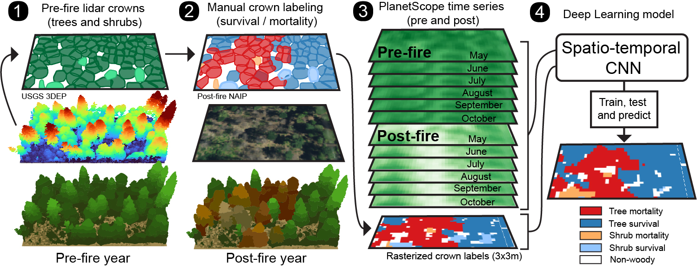

# canopy-mortality-CA

Last updated: 09.2023

Overview
--------

This repository is associated with the article "Satellite detection of canopy-scale tree mortality and survival from California wildfires with spatio-temporal deep learning" in the journal *Remote Sensing of Environment* by Dan J. Dixon, Yunzhe Zhu, Christopher F. Brown, and Yufang Jin (2023). 

Included in the paper is a workflow to detect 3-m resolution tree mortality/tree survival following wildfires in California using pre- and post-fire PlanetScope time series. The deep learning model is trained and tested with a database of canopy scale labels derived from pre-fire aerial lidar surveys paired with manual labeling from post-fire NAIP imagery. 

Graphical abstract:

  

Visualize the predicted model outputs for all 2020 California wildfires: https://bit.ly/canopy-mortality-CA

  

Also included in this repository are the following:
  - Trained tensorflow model
  - Geopackages of pre-fire canopy polygons labeled with post-fire NAIP imagery
